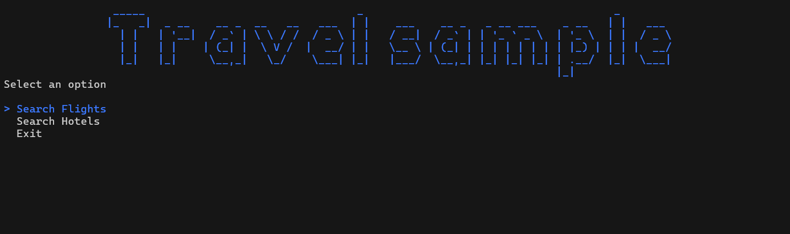

# Travel sample code
This is a sample code for travel agency. It is a simple code that allows you to have a simple search for a flight or hotel. It also allows you to cancel the booking. The code is written in C#.

This project use the Sabre API to search for flights and the Amadeus API to search hotels. 

Sabre API documentation [here](https://developer.sabre.com/).
Amadeus API documentation [here](https://developers.amadeus.com/).

## How to run the code
1. Clone the repository
2. Open the project in Visual Studio or Rider
3. Write your Sabre API data and Amadeus API data in the `appsettings.json` file
4. Run the project
5. Enjoy the code

## How to use the code
1. In the main menu select the option you want to use
2. Follow the instructions
3. Enjoy the code

